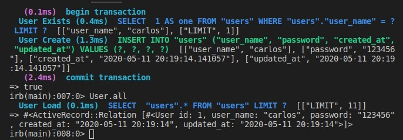

# README

> This is a project for Microverse create a basig redit back end clone

## Getting started

- This project was build following the guidelines of the Odin project [Active records](https://www.theodinproject.com/courses/ruby-on-rails/lessons/building-with-active-record-ruby-on-rails)

## Built with

- vscode
- ruby on rails

👤 **Johann Rodríguez**
- Github: [@JohannRodriguez](https://github.com/JohannRodriguez)
- Twitter: [@BSapce](https://https://twitter.com/BSapce)
- Linkedin: [Johann Rodríguez](https://www.linkedin.com/in/johann-alonso-rodr%C3%ADguez-v%C3%A1zquez-25b07719a/)

👤 **Carlos Prieto**
- Github: [@carlosprietobarron](https://github.com/carlosprietobarron)
- Linkedin: [Carlos Prieto](https://www.linkedin.com/in/carlos-prieto-41a2b018b/)
- Email: [Carlos Prieto Barrón](carloprietobarron@gmail.com)

Contributions, issues and feature requests are welcome!

Feel free to check the [issues page](https://github.com/JohannRodriguez/micro_reddit/issues).

## Show your support

Give a ⭐️ if you like this project!

## 📝 License

This project is [MIT](lic.url) licensed.
